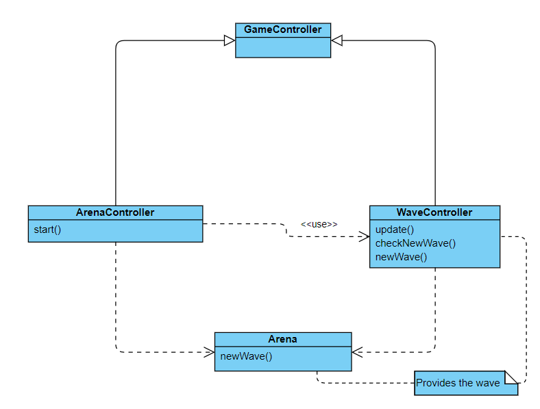
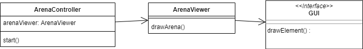
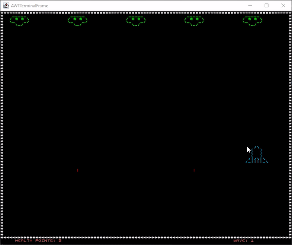
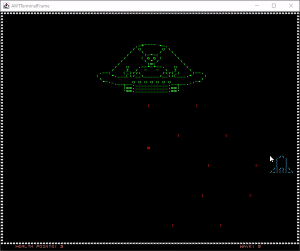

#Space Invaders
##Game Logic

In this incredible platform game you can destroy waves of aliens with 
your own ship. The objective is to get to the highest wave possible.

The player's ship can move to the sides and can go up and down within a
certain fixed range. The ship has 3 lives.

The aliens are static and shoot downwards, randomly. Each alien has 1HP 
which means that if the player shoots the alien, it will die instantly.

Asteroids move laterally and can only appear within the vertical range
of the ship. They show up at the 3rd wave.

The waves of aliens show up until the player as no more lives. Their
difficulty is increased as the game advances. This is done by adding more
aliens and by increasing the number of enemies that shoot against the player. 

##Implemented Features

By the end of the project, the implemented features are:
- Arena elements: the SpaceShip, the Aliens and the SuperAlien are displayed
  in the screen and depend on the wave that is currently being played. 
- Moving SpaceShip: The character moves with the mouse. It can only
  go upwards about halfway of the game screen. Laterally and in the bottom,
  the movement is limited by the walls.
- Moving Asteroids: Once spawned, they move horizontally coming from both
  sides of the arena. They only show up in the bottom half of the arena.
- Shooting: The Spaceship shoots upwards when the left side of the mouse is
  pressed or when the space bar is pressed. The Aliens and the SuperAlien shoot
  downwards randomly, and the frequency of the shooting increases as the waves go by.
- Collision: If one of the bullets of the gama character hits an Alien, he
  immediately dies and is removed from the arena. If it hits the SuperAlien,
  then he loses one of his 5 lives. If any of the aliens (including the
  SuperAlien) shoots and hits the SpaceShip, the character loses one of his
  three lives.
- Wave Mechanic: The game is regulated by waves. As they increase, the number
  of Aliens and Asteroids spawned, and the frequency of the Aliens' bullets
  will also increase. Every five levels, there will appear a SuperAlien,
  instead of the regular aliens.

#####Extra features
- SuperAlien: An alien bigger and with more lives (5) that can shoot twice at the
  same time will show up at every five levels. It moves laterally, only
  horizontally. As the SuperAlien lives decrease, its color will change, from
  green to red shades.
  

##Planned Features

- Menu: The player should be able to play another game without closing the
  current window and opening a new one. This will be possible as long as the
  player wants to keep playing the game in order to augment his high score.

##Design

1) The game arena must change as an internal state changes.
2) How to get input from the GUI to the game Controller.

### Problem in context
1) The game must increase its difficulty over progression. Therefore, it must
consecutively change. Doing so improperly may trigger violations on the Common
Closure Principle, for example.
    
2) In our game, we need to get the input from the mouse, so our SpaceShip is able to move and is 
   correctly displayed.

### The Pattern
1) We have implemented the State pattern. This way, the mutation of certain elements
of the game is held responsible by just a single variable inside the code. But, it was
implemented in two distinct packages, so the Common Closure Principle was violated
nonetheless, but it was curbed to a minimum.
   
2) The Command pattern was utilized. This way, we leave each controllable element 
   execute its actions at the opportune time.

###Implementation

1)

These classes can be found in the following files:

- [GameController](../src/main/java/com/anaramada/SI/controller/GameController.java)
- [ArenaController](../src/main/java/com/anaramada/SI/controller/ArenaController.java)
- [WaveController](../src/main/java/com/anaramada/SI/controller/WaveController.java)
- [Arena](../src/main/java/com/anaramada/SI/model/Arena.java)

2)

These classes can be found in the following files:

- [ArenaController](../src/main/java/com/anaramada/SI/controller/ArenaController.java) 
- [ArenaViewer](../src/main/java/com/anaramada/SI/viewer/ArenaViewer.java)
- [GUI](../src/main/java/com/anaramada/SI/gui/GUI.java)

###Consequences

1) The state pattern bettered our code, because:
- It kept the changing state to a single variable, therefore making it simple to implement.

2) In turn, the control pattern contributed in a good way, because:
- It was easy to change the controls, since we passed from moving the SpaceShip 
  with the keyboard to moving it with the mouse.
- It is easy to add new commands, if required.

##Architectural Pattern

We opted for the use of the Model-View-Controller (MVC), where the com.anaramada.SI.model
represents all the elements such as the aliens, the spaceship and its bullets, the arena
and the arena builder, and also the asteroids.

## Code Smells and Refactoring Methods

##### Data Clumps
There are many functions regarding the movement of the SpaceShip that do basically
the same but have slightly different names and make the SpaceShip move in different
directions. There was probably a way to do all this in the same function, but we
decided to let it the way it is because it's easier to use and to understand what
the code does.
This refactoring method is called Extract Method.

Solution : With the advance of the project we solved this problem by changing the
commands to a simple function, moveSpaceShip, that only receives the mouse Position.
Now we only have one function regarding the movement of the game character.

##### Dead Code
There is some dead code in the project, for example, in the SpaceShipController
class where there are some methods that are no longer used and should be eliminated.

##### Collisions - Composing Methods
In the beginning of the project we were treating the collisions in each controller separately. 
This made a lot of code duplication.

Solution: Because almost all the collision involved bullets, 
we replaced the methods used with a method object, the collisionController.

##Testing

We've done a number of tests to the majority of the packages, with the notable
exclusion of the GUI. We have managed to cover around 75% of the classes, but
the mutation tests came out a bit lackluster, as we can see in the information 
below.

- Coverage report
  
  
  
- Link to mutation testing report

  [Mutation Test](../docs/Reports/202105302226/index.html)

- Link to tests report
  
  [Test Report](../docs/Reports/tests/test/index.html)

##Demostration
####First Wave example
The 5 aliens are killed and then the second wave begins.
As shown, the game ends when the spaceShip is hit by an asteroid.

####Super Alien

##Self-evaluation

The disproportionate representation in the number of commits is due to the fact
that we worked with the screen-share feature of the IntelliJ IDE. Taking that
into consideration, we believe that the work distribution was:

Afonso Monteiro - 1/3;
Ana Rita Ramada - 1/3;
Isabel Silva - 1/3;

##Project by:
Afonso Monteiro (up201907284@edu.fe.up.pt) 
Ana Rita Ramada (up201904565@edu.fe.up.pt) 
Isabel Silva (up201904925@edu.fe.up.pt)